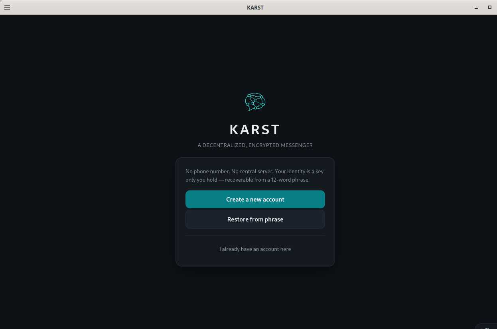
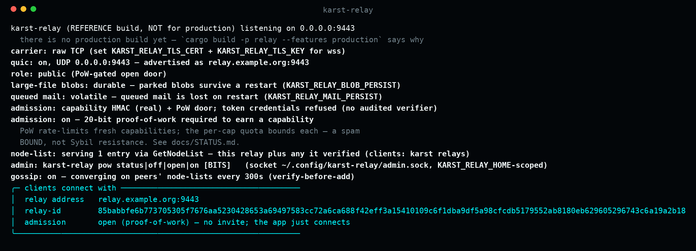
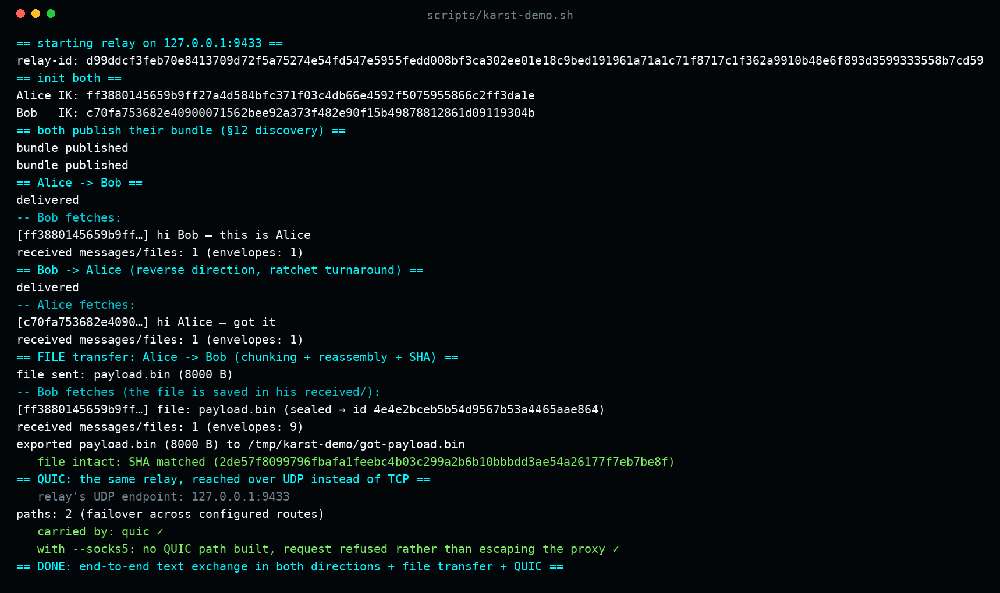

<p align="center">
  
</p>

# KARST

**Experimental open-source private messenger with end-to-end encryption and hybrid post-quantum key agreement.**
Built in Rust around independently operated relays.


[](https://t.me/karstmessenger)

> [!WARNING]
> KARST is an experimental pre-alpha reference implementation.
> Its cryptographic composition has not been independently audited.
> Do not rely on it for high-risk communications or situations in which a
> security, privacy, or availability failure could endanger a person.
> Some primitives (the threshold ring signature, §7.3) are feature-gated behind `--features unaudited-crypto` and off by default.
> [`docs/STATUS.md`](docs/STATUS.md) is an honest, line-by-line maturity map; [`docs/SECURITY_CLAIMS.md`](docs/SECURITY_CLAIMS.md) is the claims matrix no material should exceed. Report vulnerabilities via [`SECURITY.md`](SECURITY.md).

---

## See it running

The desktop client — no phone number, no signup; your identity is a 24-word phrase.

<p align="center"></p>

Anyone can run a relay with one command. It is a dumb, untrusted mailbox — it never sees your plaintext, and it can be toggled (open door / proof-of-work / off) live, discover other relays, and gossip about them (verified before trusting):

<p align="center"></p>

Two clients messaging end-to-end through a relay, both directions — real output from a real run:

<p align="center"></p>

---

## What KARST is

KARST is an experimental open-source private messenger. It uses end-to-end encryption, a hybrid key agreement combining post-quantum and classical cryptography, and independently operated relays. The project is designed to give users control over their cryptographic identity and reduce dependence on a single service provider.

It is designed around common real-world security risks: stolen credentials, compromised servers, malicious network intermediaries, contact-key substitution, data breaches, and long-term collection of encrypted traffic. Relays are treated as untrusted transport infrastructure — they are not intended to access plaintext message content. Users can verify contact identities through safety numbers, and local message history is protected with encryption at rest.

KARST does not claim complete anonymity, immunity from compromise, guaranteed delivery, or protection against every attacker. It is built to defend against **malicious actors** — cybercriminals, account thieves, malicious network intermediaries, and operators of compromised relays — by what an attacker can *do*: intercept, alter, impersonate, correlate traffic, or disrupt communication. The full threat model is in [SECURITY.md](SECURITY.md).

### Principles

1. **Open design.** The protocol and source code are public. Security must depend on protected keys and reviewed cryptographic mechanisms, not secrecy of implementation (Kerckhoffs). Only keys, one-time capabilities, and momentary network state are secret.

2. **End-to-end confidentiality.** Relays transport encrypted envelopes and are not intended to access plaintext message content, so a compromised relay learns far less than a plaintext server would.

3. **Hybrid post-quantum key agreement.** Initial key establishment combines ML-KEM-768 and X25519, followed by a Double Ratchet. The intent is to reduce *harvest-now-decrypt-later* risk. The composition is experimental and independently unaudited.

4. **Independent relays.** The protocol does not require a single mandatory relay operator. Users may connect through independently administered infrastructure, and the design continues to operate when individual relay endpoints or network paths become unavailable.

5. **Resource-bounded relay operation.** Admission controls, quotas, and resource limits are used to reduce abuse and resource exhaustion. Every scarce resource requires an address check and a cryptographic admission proof first.

6. **Explicit privacy boundaries.** KARST documents which metadata may remain visible to clients, relays, transport providers, and network observers. *Reality check:* today the relay **does** learn both ends of a deposit — the sender's identity key sits next to the recipient's mailbox, an opener repeats it in the payload, and rate limiting rides a shared capability rather than an anonymous credential. Full source/destination unlinkability needs mix-routing and multiple non-colluding relays that do not exist yet. See **"What the relay learns"** in [`docs/STATUS.md`](docs/STATUS.md), written out field by field. The [proxy-identity model](docs/design/proxy-identity.md) (roadmap phases 1–5) is the direction: a root identity with no address of its own, reached only through disposable, rotatable proxies.

7. **Honesty over marketing.** Experimental, partial, or unaudited properties are always labelled as such. The spec states what it *cannot* guarantee. A verifiable, honest build beats a silently compromised one — which is why the audit status above is stated first, not last. No public material should exceed [`docs/SECURITY_CLAIMS.md`](docs/SECURITY_CLAIMS.md).

### Privacy limitations

KARST is a private messenger, **not an anonymity system**. Stated plainly:

- KARST does not guarantee anonymity.
- A network provider or proxy can see your network connections.
- A relay can see certain metadata (see [`docs/STATUS.md`](docs/STATUS.md)).
- Timing and volume correlation may remain possible.
- Tor, VPN, or I2P are user-configured network options — they do not replace application-level metadata protection.
- The current implementation is experimental and independently unaudited.

See [`RESPONSIBLE_USE.md`](RESPONSIBLE_USE.md) for the project's intended purpose and use boundaries.

## Architecture

A Rust workspace of four crates:

| Crate (binary) | Role |
|----------------|------|
| `admission` | Cryptographic admission path (§7): stateless cookie, capability, RLN quota core, DTN class, threshold ring. |
| `node` (`karst-relay`) | Relay node **and** the end-to-end session layer — PQXDH key agreement, Double Ratchet, safety number, relay-mediated discovery. |
| `client` (`karst`) | CLI and library: identity from a BIP39 recovery phrase, encrypted at-rest vault, persistent sessions. |
| `desktop` (`karst-desktop`) | Desktop client (Tauri: web frontend in a native webview over the shared `client`/`node` core): accounts, chats, relay + invite config, safety-number verification, file transfer with progress/cancel, profiles. |

### Security properties and their maturity

Each claim is hedged to match [`docs/STATUS.md`](docs/STATUS.md) — the authoritative record of what is actually implemented (the protocol design itself lives in `KARST_SPEC.md`). "Reference, unaudited" means real, working code using vendored primitives, with a hand-written protocol composition that has **not** been through an independent audit.

| Property | How | Maturity |
|----------|-----|----------|
| End-to-end encryption | PQXDH (X3DH + ML-KEM-768, FIPS 203) → Double Ratchet | Reference · **unaudited** |
| Post-quantum secrecy | ML-KEM-768 hybrid, load-bearing in the root key | Reference · **unaudited** |
| Encryption at rest | Argon2id + XChaCha20-Poly1305, multi-account vault | Real |
| Contact authenticity | 60-digit safety number, Signal format (out-of-band check) | Real |
| DoS admission | Stateless cookie + capability + staged pipeline | Real |
| Anonymous rate limiting (RLN) | Nullifier + Shamir-slashing quota tracker | Real core; full path returns `RlnNotImplemented` (zk membership circuit is stubbed) |
| Threshold ring signature | CDS construction over Ristretto255 | Reference · **unaudited** · feature-gated |
| Transport — message-size hardening | length padding to fixed buckets + fixed-size fetches (queue depth hidden), inside the session | Real |
| Transport — WebSocket-over-TLS carrier | Carries the encrypted KARST protocol over standards-compliant `wss://` (`rustls` + `tungstenite`), opt-in, needs a real cert; a transport encapsulation, not a security property. Does not guarantee traffic indistinguishability — IP, SNI, and behavioural characteristics may remain observable | Real · wired · SNI still cleartext |
| Transport — external PT | SOCKS5 route to Tor / obfs4 | Wired |

`docs/STATUS.md` also names the three **external walls** — an RLN zk-circuit, an audit of the threshold ring, and a Poseidon substitution — where the reference stops and production work would begin.

## Install and run

> Reference build, **Linux desktop** (relay + CLI `karst` + the Tauri desktop
> client `karst-desktop`).
> Not for production. There are no binary releases yet — you build from source.

### 1. Prerequisites

- **Rust** (stable, 2021 edition) via [rustup](https://rustup.rs): `rustup toolchain install stable`.
- A **C toolchain** (`cc`/`build-essential`) for a few native dependencies.
- For the **Tauri desktop client** only: a graphical session plus WebKitGTK and
  GTK dev libraries — on Debian/Ubuntu: `libwebkit2gtk-4.1-dev libgtk-3-dev
  libsoup-3.0-dev libjavascriptcoregtk-4.1-dev librsvg2-dev`. No `tauri-cli` is
  needed — the frontend is a static bundle, so a plain `cargo run -p desktop`
  builds and launches it.
- Optional, for user-configured proxy transport: a local **SOCKS5** proxy such as
  the Tor daemon (`tor`, default `127.0.0.1:9050`) or obfs4.

### 2. Install (scripts)

The quickest path — clone, then run the installer for what you want. Both build a
release binary into `~/.local/bin` and are safe to re-run after a `git pull` to
update.

```sh
git clone https://github.com/bytesoffreedom/karst
cd karst

scripts/install-karst.sh         # the messenger: CLI `karst` + desktop `karst-desktop`
#                                  (add --no-gui on a headless box)

scripts/install-node.sh          # a relay node — interactive: it asks for the
#                                  listen address, whether to enable the wss
#                                  carrier (needs a real TLS cert), and optionally
#                                  installs a systemd --user service; it prints the
#                                  relay-id to give your peers, and preserves that
#                                  identity across re-runs.
```

The node installer states the maturity caveats up front (a relay is an untrusted
mailbox; the admission layer ships a dev capability with a public secret; the
crypto is unaudited reference).

### 2b. Build manually

```sh
cd karst/impl
cargo build --release            # builds relay + CLI + the desktop client
# binaries land in impl/target/release/: karst-relay, karst, karst-desktop

# Or run the Tauri desktop client directly (needs the WebKitGTK deps above):
cargo run -p desktop
```

Sanity-check the build:

```sh
cargo test                               # default (audited-primitive path)
cargo test --features unaudited-crypto   # + the reference §7.3 crypto
cargo clippy --all-targets
```

### 2c. Verify a downloaded release

Prebuilt release binaries (`karst`, `karst-relay`) ship with a `SHA256SUMS` file
signed by the project's [minisign](https://jedisct1.github.io/minisign/) key. The
public key is:

```
<KARST_MINISIGN_PUBLIC_KEY — filled in when the first release is cut; see docs/RELEASING.md>
```

```sh
minisign -Vm SHA256SUMS -P <that public key>   # signature is the project's
sha256sum -c SHA256SUMS                         # binaries match the checksums
```

**Strongest — rebuild and compare, trusting neither the binary nor the signature.**
A signed-but-backdoored build is still signed; a *reproduced* build provably matches
the public source. `scripts/build-reproducible.sh` produces byte-identical binaries
on the pinned toolchain (verified across build paths):

```sh
git checkout <release-tag>
impl/scripts/build-reproducible.sh   # prints the same sha256s as SHA256SUMS
```

See `docs/RELEASING.md` and `docs/design/reproducible-builds.md` for the full story.

### 3. Run a relay node

A relay is a **dumb, untrusted mailbox**: it does not receive plaintext and is not
intended to maintain a persistent social graph, but it can observe transport and
protocol metadata (described in [`docs/STATUS.md`](docs/STATUS.md) — IP, timing, the
deposit/fetch of a single drop-box, blob IDs, and, on a live profile fetch, who views
whose profile). It holds only the sealed messages waiting to be picked up and the
prekey bundles people publish to be reachable. Anyone can run one; running your own
removes reliance on someone else's.

```sh
karst-relay                     # listens on 127.0.0.1:9000 (default)
karst-relay 0.0.0.0:9000        # listen on all interfaces (public relay)
```

On start it prints a **`relay-id`** — clients need the address **and** this id
(it pins the relay's Noise + fetch-auth public keys, so a MITM can't impersonate
the relay). The id is stable across restarts.

| Relay setting | How | Default |
|---|---|---|
| Listen address / port | first CLI argument, else `KARST_RELAY_ADDR` env | `127.0.0.1:9000` |
| Node key location | `KARST_RELAY_HOME` env | `~/.config/karst-relay/relay.key` (0600) |
| Role (the admission door) | `KARST_RELAY_MODE` env: `private` \| `public` \| `dev` | `private` — invite-only: a random per-relay secret, persisted; the relay writes `invite.json` and a peer joins with `karst import-cap <that file>`. `public` = open door (STAGED — flood-exposed until the PoW anti-spam gate lands), and it **refuses to start unless `KARST_RELAY_ALLOW_UNSAFE_PUBLIC=1`** is also set (explicit opt-in). `dev` = the known public test cap so `karst dev-cap` reaches it (local testing only). An **unknown** mode value refuses to start rather than silently defaulting |
| relay-id | printed on start (`relay-id …`) | derived from the node key (stable) |
| wss carrier (WebSocket-over-TLS) | `KARST_RELAY_TLS_CERT` + `KARST_RELAY_TLS_KEY` (PEM) | off (raw TCP); set both to terminate `wss` — use a real cert for the relay's hostname |

For internet reach: run it on a host/port you control, open the firewall, and
give peers `address` + `relay-id`. Because a relay is untrusted and carries only
sealed traffic, you can run several and clients can switch between them.

### 4. Run a client

Both clients read the same per-profile state directory and the same environment.

| Client setting | Env var | Notes |
|---|---|---|
| Profile / state dir | `KARST_HOME` | secrets, contacts, history (encrypted at rest); default `~/.config/karst` |
| Relay address | `KARST_RELAY` | e.g. `127.0.0.1:9000` (GUI prefills the field) |
| Relay id | `KARST_RELAY_ID` | the id the relay printed |
| Alternate relay endpoints | `KARST_RELAY_ALTS` | `host:port,host:port` — extra routes on the **same** carrier (never a silent downgrade). A host may be an IP **or a name** — including an onion-service or `.i2p` relay endpoint (`abc.onion:443`, `xyz.i2p:9000`) reached through a compatible SOCKS proxy. A name only works through a resolving carrier (SOCKS); a direct route refuses it rather than leaking a DNS lookup. In the GUI this only *prefills* the **extra routes (failover)** field, which is what actually gets used; the CLI reads it directly |
| Mixed-carrier routes | `KARST_PATHS` | `kind@ip:port,…` where kind is `direct`\|`socks5`\|`wss`\|`wss+socks5` — automatic transport switching: extra routes that may use a **different carrier**. Each is filtered against the carrier you chose, so switching can never trade it away: a Tor user's list drops `direct` **and** bare `wss` routes; a wss user's drops `direct` and bare `socks5`. If every allowed route is dead the connection fails — it never falls back to a route you didn't ask for. Same as above: in the GUI it prefills the **extra routes** field (both syntaxes go in that one field — the `@` tells them apart) |
| SOCKS5 proxy | `KARST_SOCKS5` | e.g. `127.0.0.1:9050` for Tor; empty = direct |
| wss carrier host | `KARST_WSS` | SNI host to present, e.g. `relay.example.com`; connects to `KARST_RELAY` and carries the encrypted protocol over standards-compliant WebSocket-over-TLS. Takes precedence over `KARST_SOCKS5`; empty = off. Append an unguessable path to co-host behind a real website on one domain: `relay.example.com/s3cret-9f2a` presents the site's SNI and requests that path, which the operator's reverse proxy routes to the relay while everything else serves the site. An unguessable path reduces unsolicited endpoint discovery; a predictable one is an observable feature. This does not guarantee indistinguishability from browser traffic. |
| Device passphrase | `KARST_PASSPHRASE` | CLI only; encrypts secrets at rest (**not** the recovery phrase) |

Whichever carrier ends up active — direct, SOCKS5, wss, or wss-over-SOCKS5 — is
shown back to you so it is never a silent assumption: the GUI has a `via …` chip in
the status bar, and the CLI prints `carrier: …` before each networked command. If
you set a proxy or `KARST_WSS`, you can confirm it is really in effect. The GUI's
**chrome and status toasts are localized into 9 languages** (English, 中文, Español,
Português, Bahasa Indonesia, Français, 日本語, Русский, Deutsch); a few
auto-generated labels (default account names, the placeholder for an as-yet-unnamed
contact) are still English-only.

**Desktop client** (`karst-desktop`) — the actively-developed client (Tauri web
frontend over the shared core). Launch with `cargo run -p desktop`.

1. First run → **Create account**: write down the **24-word recovery phrase** (the
   only way to restore on another device), confirm the words, set a **device
   passphrase** (encrypts secrets on *this* disk — different from the phrase).
   Later runs → just the passphrase.
2. Point it at a relay (paste the relay's `invite.json` for a private relay).
3. Copy your **address (IK)** and give it to your contact out-of-band; paste
   theirs in as a contact. There is deliberately no "find by name" on the relay
   (that would reintroduce a MITM — see Principle 3).
4. Expand the **safety number** and confirm it matches on both sides.
5. Chat, transfer files with a cancellable progress bar, set disappearing timers.

**CLI** (`karst`) — headless/testing. With `$R="--relay <addr> --relay-id <id>"`:

```sh
export KARST_HOME=/tmp/alice KARST_PASSPHRASE=pw
karst init                       # prints your recovery phrase + address (IK)
karst dev-cap                    # install the local dev admission capability
karst publish $R                 # announce your bundle so others can reach you
karst send $R --to <PEER_IK> "hello"
karst send-file $R --to <PEER_IK> --file ./pic.jpg
karst recv $R                    # fetch inbox; files land in $KARST_HOME/received/
# restore on a new device (into an empty KARST_HOME): karst restore word1 … word12
```

### 5. Try the whole system locally

Helper scripts bring up a relay and wire the network id in for you:

```sh
scripts/karst-demo.sh           # one-shot: relay + two clients + round-trip, then cleans up
scripts/karst-wss-demo.sh       # same round-trip, but through the WebSocket-over-TLS carrier
# or, to keep it running:
scripts/karst-up.sh             # start a relay on 127.0.0.1:9000, print ready-to-paste commands
cd impl && cargo run -p desktop  # the desktop client (paste the relay-id it printed)
scripts/karst-down.sh           # stop the relay
```

See [`docs/RUNNING.md`](docs/RUNNING.md) for the full local walkthrough and the
"it works" checklist.

## Repository layout

```
impl/            Rust workspace: admission, node, client, gui
docs/            STATUS.md (maturity map) · RUNNING.md (local run)
scripts/         local-run helpers
KARST_SPEC.md   protocol specification — normative protocol design
```

> `KARST_SPEC.md` is the normative protocol design and code must conform to it; [`docs/STATUS.md`](docs/STATUS.md) is authoritative on what is actually implemented, stubbed, or blocked so far. Where the spec describes a design the code has not reached yet, STATUS says so.

## How it's built

KARST's core is developed with AI assistance under human review, one reviewed slice at a time, each covered by *discriminating* tests (neuter the fix → the test must go red → restore). The project is developed publicly and non-commercially, without a single mandatory operator. The tradeoff is stated plainly above — the cryptography is a reference implementation and has not been audited.

## Follow the build

**[t.me/karstmessenger](https://t.me/karstmessenger)** — a running development
log, in plain and occasionally sarcastic English. Every push to this repo gets a
post explaining what shipped and why.

The unusual part: **the log is written by the AI agent doing the work**, not by
a human summarising it afterwards. So it is a first-person account of the
build — including the parts that are not flattering. Recent entries have
covered a privacy defect the agent found in its own already-shipped code, a
planned refactor that was evaluated and rejected as the wrong design, and
features deliberately *not* built because they would have manufactured metadata
the architecture exists to avoid.

That is the point of publishing it. A changelog tells you what landed; this
tells you what was considered, what was refused, and what turned out to be
wrong — which is the part that usually never leaves a private branch. Human
review sits on top of every slice (see *How it's built* above); the log is the
reasoning, not the approval.

## Responsible use

KARST is intended for lawful private communication, interoperability research, cryptographic engineering, and testing of independently operated messaging infrastructure. It is **not** designed, endorsed, or promoted for unauthorized access, malware, attacks on third-party infrastructure, fraud, harassment, illegal trade, or extremist or terrorist activity. Because KARST is open-source and relays may be operated independently, the maintainers cannot monitor, decrypt, approve, or control all uses or deployments.

**What KARST is not.** By design, KARST is **not** a general-purpose VPN, an Internet proxy, an arbitrary TCP/UDP tunnel, a Tor exit, or a tool that interferes with filtering or security equipment — it carries only KARST protocol messages and files between consenting users through relays whose operators chose to participate. See [`RESPONSIBLE_USE.md`](RESPONSIBLE_USE.md) (intended purpose, prohibited uses) and [`docs/TECHNICAL_BOUNDARIES.md`](docs/TECHNICAL_BOUNDARIES.md) (the technical boundaries, backed by tests).

## Contributing

Early stage. Start from `KARST_SPEC.md` (the source of truth), `docs/STATUS.md` (what is real, stubbed, or blocked), and [`docs/ROADMAP.md`](docs/ROADMAP.md) (the principle-compatible feature backlog). Contributions are expected to respect the project's technical boundaries and responsible-use scope ([`RESPONSIBLE_USE.md`](RESPONSIBLE_USE.md)). Please **do not** open public issues for vulnerabilities — use the private channel described in [`SECURITY.md`](SECURITY.md).

## License

[GNU AGPLv3](LICENSE). Copyleft with a network clause: any fork, and any service that runs this code, must remain open under the same license. A proprietary closed fork is not possible.
